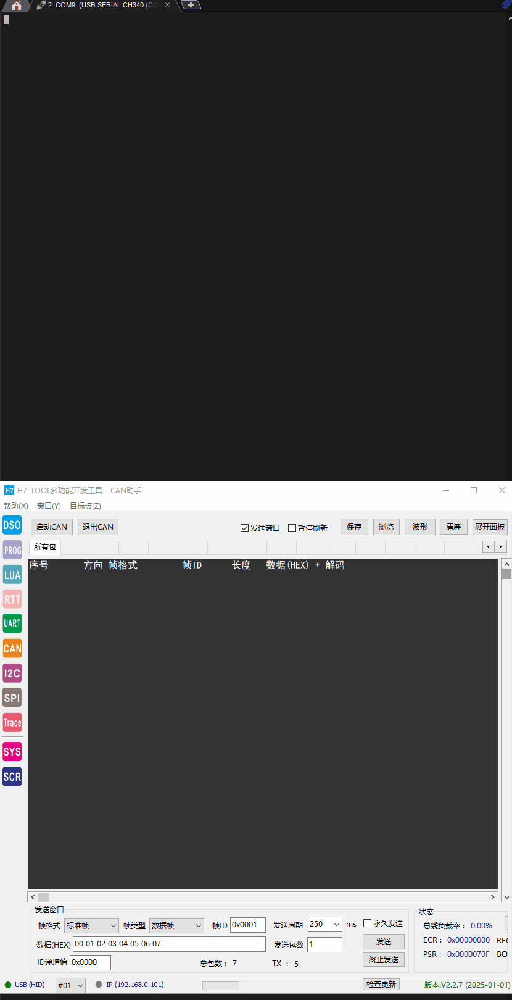

# Ls_Monitor

#### 介绍
本项目属于(个人)车载设备，硬件使用正点原子STM32F407核心板,配合一块底板,软件使用各种教程进行缝合.

#### 目录介绍
|     文件夹      |              内容              |
| :-------------: | :----------------------------: |
|      Core       |        M4内核的启动文件        |
|   EW-ARM(v8x)   |         IAR配置的工程          |
|     HAL_lib     |    ST提供的底层文件，HAL库     |
|     SYSTEM      | 包含有除main.c外的外设驱动文件 |
|      User       | main.c文件和编译信息的.txt文件 |
|  MDK-ARM(uV5)   |         Keil配置的工程         |
| Third_Libraries |   第三方框架用来增加项目功能   |
|      Main       |        main函数调用接口        |

#### 实现功能

|    时间    |                             内容                             |
| :--------: | :----------------------------------------------------------: |
| 2022-04-18 |                  实现3个USART串口的FIFO驱动                  |
| 2022-04-20 |                     实现板载按键FIFO驱动                     |
| 2022-05-03 |                   实现板载FLASH芯片的读写                    |
| 2022-05-06 |                   实现板载EEPROM芯片的读写                   |
| 2022-05-11 |              实现微雪2.9寸三色墨水屏的驱动移植               |
| 2022-05-26 |                   实现1路CAN总线报文的读写                   |
| 2022-06-07 |            实现PWM驱动，特别对PA6做了DMA数据输出             |
| 2022-06-09 | 实现WS2812B-RGB(NUM:12)驱动,渐变灯、流水灯、特定序号、点亮特定序号段灯效 |
| 2022-06-15 |               实现1路霍尔式轮速传感器信号采集                |
| 2022-06-21 |      实现ADS1256模块进行模拟量采集(8路，0-5v，模拟SPI)       |
| 2022-06-26 |                    实现LCD显示与触摸驱动                     |
| 2022-07-02 | 实现MLX90614红外温度传感器数据采集(iic总线在读写eeprom时400k，改为60k) |
| 2022-07-05 |         实现FatFs文件系统挂载SD卡(底层驱动全部完成)          |
| 2022-08-23 |                   实现LVGL8.2.0UI组件移植                    |
| 2022-09-12 |                  实现LVGL外部flash读取字库                   |
| 2022-09-18 |                 实现LVGL外部SD卡加载bin图片                  |
| 2023-04-02 |       初步完善5个界面与主界面绘制，并找到hardfault位置       |
| 2025-02-05 |             移植Nr_Micro_Shell框架，调整文件目录             |
| 2025-03-09 |    实现2路CAN总线报文的读写，更换phy芯片，实现1M速率通讯     |

#### 使用说明
- 打开工程，进入main函数，可以看到任务调度函数，并且开启了6个任务例程和简单的队列间通信的例程，其他的例如flashdemo、eepromdemo、墨水屏驱动，板载外设的驱动需要开启宏定义后者自行调用功能函数。
- 创建一个0.5s的软件定时器，不断调用轮速信号采集函数，PB6引脚输出500hz方波，接线在PA15轮速传感器引脚。
- 按下keyup按键串口打印MLX90614红外温度传感器的温度。
- 板载的两个LED灯每隔一秒点亮一次，屏幕显示所需要的界面按钮。
- 可调踏板UI、关于本机UI，密码锁屏UI、电池箱数据UI、传感器数据UI等界面完成。
- 移植Nr_Micro_Shell框架，并实现IAR IDE适配，打开串口，输入 listcase 即可查看目前注册的所有测试用例。
- (此状态会随着驱动的状态不断更新)。

#### 占用PIN脚

####  **LVGL模拟器效果** 


#### 串口终端命令



#### 仓库拉取命令

- ##### gitee地址：

    - ```c
        git clone https://gitee.com/tian-runxian/Ls_Monitor_Lower.git --recurse-submodules
        ```

- ##### github地址：

    - ```c
        git clone https://github.com/PeakCrow/Stm32F4_Outlook.git --recurse-submodules
        ```

    

#### TO DO

- bootloader(%0)
- MQTT(%0)
- Board(50%)
- ...
